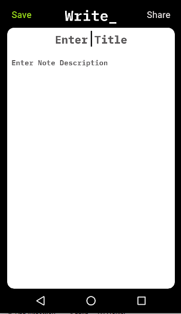

# Write_
Simple Note App to perform operations like add, edit and delete note. Here i am demonstrate the use of Modern Android development tools - (Kotlin, Architecture Components, MVVM, Room, Material Components)

Used Modern Development Toolkit i.e Jetpack Compose to Build Modern E-Commerce App (In Kotlin)

**Screenshots of the App Developed**

<table>
  <tr>
    <td>Splash Screen</td>
     <td>Settings Screen</td>
   </tr>
  <tr>
    <td></td>
    <td></td>
  </tr>
   
 </table>

<table>
 <tr>
    <td>Documents Screen</td>
     <td>Create Note Screen</td>
   </tr>
  <tr>
    <td></td>
    <td></td>
  </tr>
 </table>

## Built With 🛠
- [Kotlin](https://kotlinlang.org/) - First class and official programming language for Android development.
- [Android Architecture Components](https://developer.android.com/topic/libraries/architecture) - Collection of libraries that help you design robust, testable, and maintainable apps.
  - [LiveData](https://developer.android.com/topic/libraries/architecture/livedata) - Data objects that notify views when the underlying database changes.
  - [ViewModel](https://developer.android.com/topic/libraries/architecture/viewmodel) - Stores UI-related data that isn't destroyed on UI changes. 
  - [ViewBinding](https://developer.android.com/topic/libraries/view-binding) - Generates a binding class for each XML layout file present in that module and allows you to more easily write code that interacts with views.
  - [Room](https://developer.android.com/topic/libraries/architecture/room) - SQLite object mapping library.
- [Material Components for Android](https://github.com/material-components/material-components-android) - Modular and customizable Material Design UI components for Android.

## Architecture
This app uses [***MVVM (Model View View-Model)***](https://developer.android.com/jetpack/docs/guide#recommended-app-arch) architecture.

